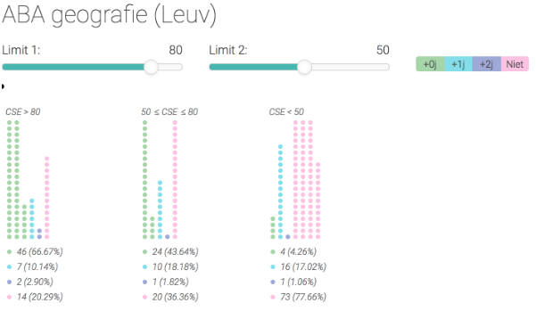

# CSETool

Outside of [LISSA dashboard](https://github.com/ABLE-KU-Leuven/stbd), a tool was developed for the student advisers to set the two thresholds defining the three groups in the Progression Visualization. The visualisation shows all available cohorts of students for the program at hand. The two thresholds defining the three students groups based on their cumulative study efficiency (CSE) are shown on top (“limit” in the visualization). Each student is represented by a dot. Based on the cumulative study efficiency of the student at hand the student dot is placed in on of three groups (left group CSE>limit1; middle group limit2<CSE<limit1, right group CSE< limit2). The color of the dot encodes the progression of the student. The same color coding is used as in the Progression Visualization:

- A green dot represents one student who obtained the bachelor or bridging programme in nominal time.
- A blue dot represents one student who obtained the bachelor or bridging programme in one year more than the nominal time.
- A purple dot represents one student who obtained the bachelor or bridging programme in two years or more than the nominal time.
- A pink dot represents one student who dropped out of the bachelor.

The student advisers can adapt each limit by adjusting the slider. Upon interaction, the student dots are relocated in real time to the different groups. This tool helps the adviser to understand how the progress of students is related to their study efficiency in the first year. Furthermore, it allows them to determine the thresholds that are most appropriate for the message they want to convey in the “Progression Visualisation”.



## How to

Be sure to install:
- [git](https://www.linode.com/docs/development/version-control/how-to-install-git-on-linux-mac-and-windows/)
- [npm](https://www.npmjs.com/get-npm)
- [bower](https://bower.io/)
- [meteor](https://www.meteor.com/install)

In your favorite terminal do:
```
git clone <this repository>
meteor npm update
bower update
meteor
```

In your browser (we suggest chrome) open: http://localhost:3000

enjoy.
